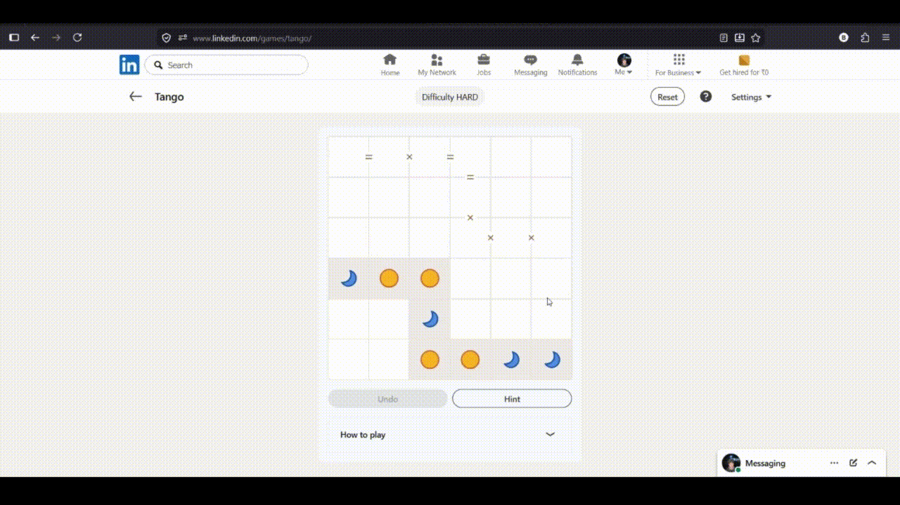

# LinkedIn Tango Solver

A browser extension that automatically solves LinkedIn's Tango puzzle directly inside the browser. Tested on Chrome, Firefox and Edge.
The extension extracts the current board state and puzzle constraints from LinkedIn's DOM, solves the puzzle using a backtracking algorithm, and automatically fills the board.

Available on Firefox: https://addons.mozilla.org/en-US/firefox/addon/linkedin-tango-solver-by-shree/ 

## Screenshots

<p align="center">
    
</p>

<p align="center">
   
</p>

## How it works:

* Automatically detects the Tango board
* Extracts existing Sun and Moon placements
* Detects equality and opposite constraints
* Solves the puzzle using a backtracking algorithm
* Simulates mouse events to fill the board in the website
* Supports both 4×4 and 6×6 boards
* One-click solve from an extension popup

## Tech stack:

* JavaScript
* Chrome Extension (Manifest V3)
* DOM Manipulation
* Recursive Backtracking
* Event Simulation

## How to install in Chrome and use:

1. Clone this repository:

```bash
git clone https://github.com/b0larp3ar/linkedin-tango-solver.git
```

2. Open Chrome and navigate to:

```
chrome://extensions
```

3. Enable **Developer Mode**.

4. Click **Load unpacked**.

5. Select the project folder.

6. Open LinkedIn Tango:

```
https://www.linkedin.com/games/tango/
```

7. Click the extension icon and press **Solve Puzzle**.

## Project Structure

```
linkedin-tango-solver/
|
├── fonts/
|
├── images/
|
├── manifest.json
|
├── main.js
|
├── popup.html
|
├── popup.css
|
├── popup.js
|
├── icon16.png
|
├── icon48.png
|
├── icon128.png
|
└── README.md
```

## Future Improvements

* Add support for future LinkedIn Tango updates


